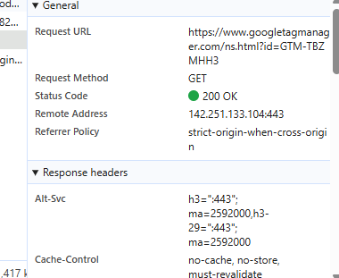
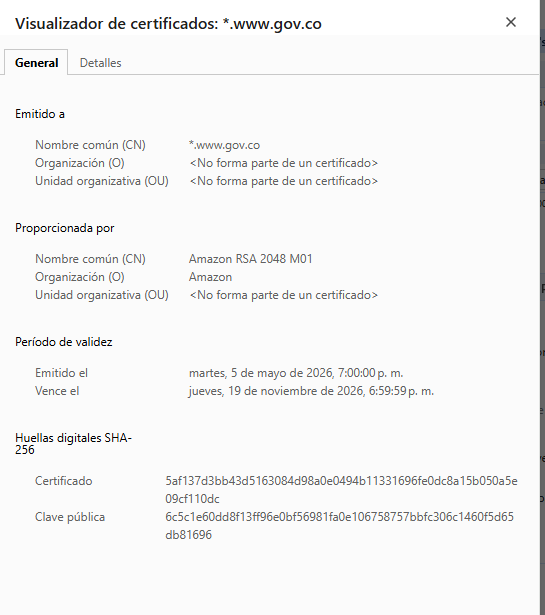
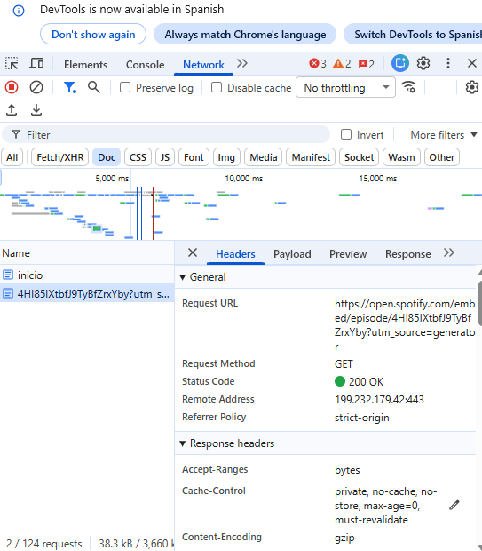
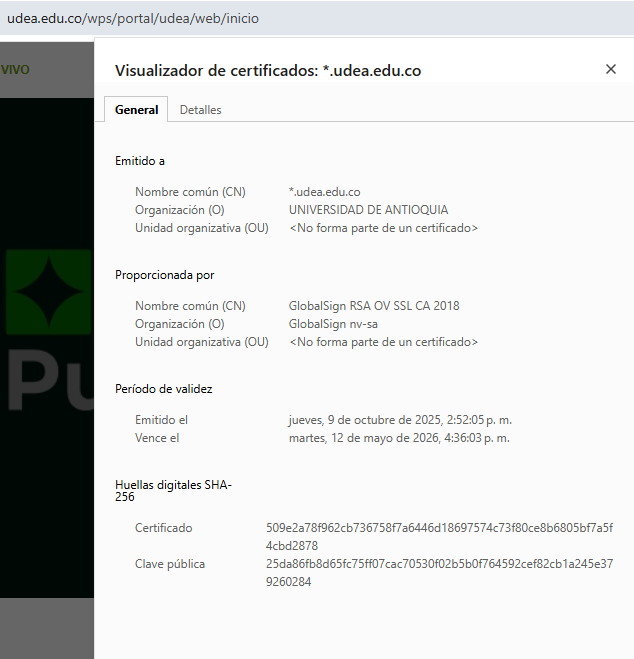

# Bitácora de inspección HTTP

**Nombre del estudiante:** David Renteria

**Programa académico:** ingenieria de sofwared

**Curso:** Lenguajes Web

**Semana:** Semana 1

**Fecha de elaboración:** 10/05/2026

## 1. Sitio del Estado colombiano

### Datos generales

**URL analizada:**

https://www.gov.co

**Fecha y hora de observación:**

10/05/2026 - 3:30 PM

**Código de estado del documento principal:**

200 OK

**TTFB:**

256 ms

**Tamaño total transferido:**

2.4 MB

**Número total de peticiones:**

75

**Redirecciones 3xx observadas:**

- 301 de `http://www.gov.co` a `https://www.gov.co`

**Autoridad emisora del certificado TLS:**

Google Trust Services

**Fecha de expiración del certificado TLS:**

05/04/2026

### Capturas

# 2. Sitio universitario

## Datos generales

**URL analizada:**

https://www.udea.edu.co

**Fecha y hora de observación:**

10/05/2026 - 4:00 PM

**Código de estado del documento principal:**

200 OK

**TTFB:**

218 ms

**Tamaño total transferido:**

1.8 MB

**Número total de peticiones:**

52

**Redirecciones 3xx observadas:**

No se observaron redirecciones 3xx relevantes.

**Autoridad emisora del certificado TLS:**

DigiCert

**Fecha de expiración del certificado TLS:**

12/04/2026

## Capturas

## Observaciones

El sitio universitario presentó una carga estable y rápida, con menos solicitudes y recursos que otros sitios analizados. Se observaron imágenes, hojas de estilo y scripts necesarios para el funcionamiento de la página.

---

# 3. Sitio comercial colombiano

## Datos generales

**URL analizada:**

https://www.exito.com

**Fecha y hora de observación:**

10/05/2026 - 4:20 PM

**Código de estado del documento principal:**

200 OK

**TTFB:**

98 ms

**Tamaño total transferido:**

5.1 MB

**Número total de peticiones:**

143

**Redirecciones 3xx observadas:**

- 301 de `http://www.exito.com` a `https://www.exito.com`

**Autoridad emisora del certificado TLS:**

Google Trust Services

**Fecha de expiración del certificado TLS:**

20/05/2026

## Capturas

## Observaciones

El sitio comercial presentó una mayor cantidad de peticiones y recursos cargados, incluyendo imágenes, scripts publicitarios y contenido dinámico. Esto generó un mayor tamaño transferido y un tiempo de carga superior en comparación con los otros sitios analizados.

### Observaciones

El sitio presenta múltiples solicitudes de red y utiliza HTTPS para garantizar una conexión segura. También carga imágenes, scripts y hojas de estilo.

## Reflexión final

Durante la inspección HTTP realizada al sitio del Estado colombiano se observó el funcionamiento de diferentes componentes relacionados con la carga de páginas web y la seguridad en la navegación. El sitio presentó un tiempo de respuesta aceptable y realizó varias peticiones necesarias para cargar correctamente imágenes, estilos y scripts. También se identificó una redirección automática desde HTTP hacia HTTPS, lo cual mejora la seguridad del sitio al proteger la información transmitida entre el usuario y el servidor. Además, se verificó la presencia de un certificado TLS válido emitido por una autoridad certificadora reconocida. El uso de DevTools permitió analizar detalles importantes como el código de estado, el tamaño transferido y el número total de peticiones realizadas durante la carga. Esta práctica ayudó a comprender mejor cómo funciona el protocolo HTTP y cómo influyen factores como las redirecciones, los certificados digitales y el rendimiento del servidor en la experiencia del usuario al navegar por internet.
